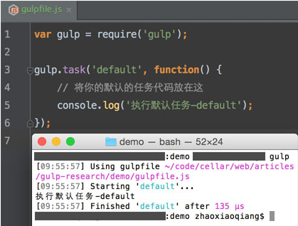

# Gulp
 
> 我也来学学这个新玩意。

## 环境

全局安装(只有全局安装的包才可以直接使用命令行)：

    $ npm install --global gulp

然后添加文件 `gulpfile.js`，在此文件所在的文件夹下运行命令 `gulp`，截图如下：

 
    
局部安装

    $ npm install gulp

如果只局部安装，通过下面命令也可以运行，原理参见另一篇文章[npm](../mpm/main.html)。

    ./node_modules/gulp/bin/gulp.js

还需要安装各种插件，这样普通的合并压缩任务才能进行

    npm install gulp-minify-css gulp-uglify gulp-concat gulp-rename gulp-jshint --save-dev
    
## 说明
    
gulpfile.js 文件中的default任务在没有参数的时候被调用，一般会在default中以 `gulp.start` 的方式调用全部任务。也可以在命令行单独执行某个任务，如 `gulp MinCSS`。

    // 任务入口
    gulp.task('default', function() {
        console.log('default任务开始');
        gulp.start(['MinCSS']);
    });
    
    // 合并压缩CSS
    gulp.task('MinCSS', function () {
        // 处理任务的代码
    });

gulp的任务都是异步执行的，如果一个任务依赖另一个，需要配置依赖。
    
    
    
## 技巧 + 实例

在 [github]() 上可以找到相关Demo。

### CSS压缩

**纯css按文件顺序合并压缩**

    var gulp = require('gulp');
    var minifycss = require('gulp-minify-css');
    var concat = require('gulp-concat');
    var rename = require('gulp-rename');
    
    gulp.task('default', ['MinCSS']);
    
    // 合并压缩CSS-1
    gulp.task('MinCSS', function () {
        var outPutFolder = 'asset/css';
        gulp.src('css-1/*.css')
            .pipe(concat('all.css'))
            .pipe(gulp.dest(outPutFolder))
            .pipe(minifycss())
            .pipe(rename('all-min.css'))
            .pipe(gulp.dest(outPutFolder));
    });

**通过import文件合并压缩**

    @import url(a.css);
    @import url(b.css);

一些项目会把所有的css通过一个import文件包含进去，方便页面引用和某些打包工具，一些老项目迁移gulp时需要一些技巧。    

    // 合并压缩CSS-2
    gulp.task('MinCSS', function () {
        var outPutFolder = 'asset/css';
        gulp.src('css-2/import.css')
            .pipe(minifycss())
            .pipe(rename('all-min.css'))
            .pipe(gulp.dest(outPutFolder));
    });

这个方法只能得到合并压缩后的css，有一个额外的好处是可以控制css文件的合并顺序。如果需要合并不压缩的文件，通过文件排除技巧来实现。

    gulp.task('MinCSS', function () {
        var outPutFolder = 'asset/css';
        gulp.src(['css-2/!(import)*.css'])
            .pipe(concat('all.css'))
            .pipe(gulp.dest(outPutFolder));
    });

## 参考资料
    
[gulp API](http://www.gulpjs.com.cn/docs/api/)
  
